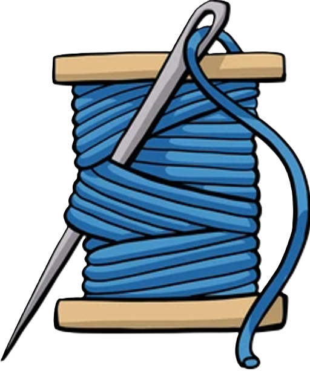
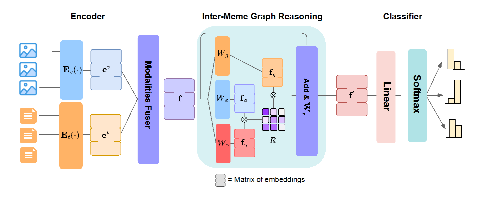

<h2 align="center"> MemeWeaver: A Multimodal Framework for Sexism and Misogyny Identification via Inter-Meme Graph Reasoning </h2>

Official source code of **MemeWeaver**, a CLIP-based multimodal framework for detecting misogyny and sexism in memes. At its core is the Inter-Meme Graph Reasoning (IMGR), a fully learnable structure that captures latent relationships between memes in an end-to-end fashion. We systematically investigate multiple visual-textual fusion strategies and demonstrate that our approach consistently outperforms state-of-the-art baselines on the MAMI and EXIST benchmarks, achieving faster training convergence, and boosting CLIP performance by approximately 5 points across all adopted metrics. 




## 🚀 Quickstart
Set up a **Docker container** to install the necessary dependencies as follows:
```bash
docker build -t memeweaver .
```

Execute the container using `docker run.
```bash
docker run -v /path_to/memeweaver:/memeweaver --rm --gpus device=$CUDA_VISIBLE_DEVICES -it memeweaver bash
```


## 📝 Prompt-Based Image Captioning 

* **Captions generation**
```bash

```
## 🔧 MemeWeaver Fine-Tuning 
Prior to fine-tuning, you must upload the MAMI and EXIST datasets to a Hugging Face repository. Make sure the repository name matches the value you pass to the `--dataset_name` parameter in `commands/train_multimodal.sh`. You can find the upload logic in `push_to_huggingface.py`. Once the datasets are available on Hugging Face, initiate fine-tuning of CLIP (MemeWeaver) on EXIST and MAMI by running:

```bash
sh commands/train_multimodal.sh
```

This command will also perform inference on both evaluation and test sets. 
